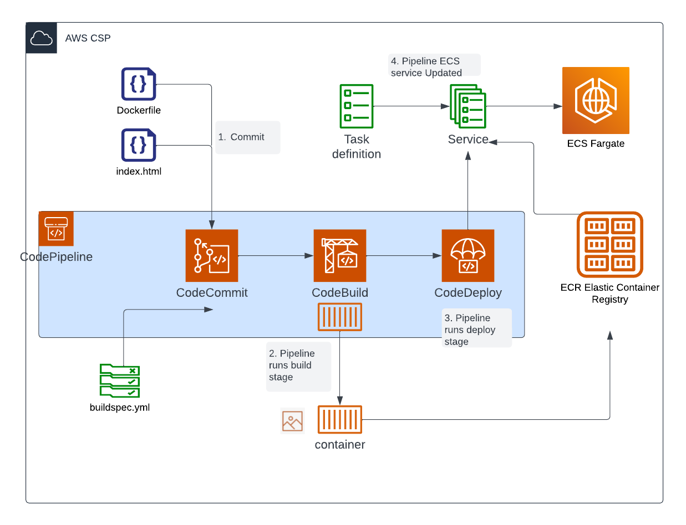

# Week 0 — Billing and Architecture

We are developing CRUDDUR, a microblogging platform that will be similar to Twitter. The project is expected to take approximately 14 weeks to complete.

During the week 'zero' in the bootcamp, I accomplished several tasks related to preparing for cloud engineering on AWS. I gained a thorough understanding of billing and architecture in AWS, which involved learning about the pricing differences between regions, and how to monitor and manage costs. For instance, I created Budgets to track expenses across resources and set up free-tier monitoring.

I also learned about security practices in AWS and how to protect data within cloud-hosted applications. I discovered the importance of an AWS account compromise and explored some basic practices to mitigate the risks. These services include AWS Organizations, which allows for account segregation and helps with managing security and billing, and AWS CloudTrail, a monitoring tool that can log and track most activities within my AWS account.

I completed several assignments during the week, including creating an admin user, installing the AWS CLI, and creating a billing alarm and budget. I also worked on some required homework such as recreating a conceptual and logical architectural diagram using LucidChart, enabling MFA for both my root and IAM users, and setting up AWS CLI environment variables.

For me, the most important lesson was understanding how to understand the proposal of high-level solutions and approaches for projects to decision-makers. I realized that it is crucial to understand business objectives and to present viable solutions that will achieve the desired outcomes.

Overall, the foundational tasks related to billing, security, and architecture that I learned during the zero week will be instrumental in my experience towards becoming a proficient cloud engineer on AWS. I am excited to continue building on these foundations in the coming weeks.


## Required Tasks:
- [X] Re-create CRUDDUR Conceptual Diagram 
- [X] Re-create CRUDDUR Logical Diagram 
- [X] Install and verify the AWS CLI on Gitpod
- [X] Create Billing and Budget Alarms 


## Conceptual Diagram

High level Architecture design to present for stakeholders.


### Logical Architecture Flow

Detailed design of the architecture for the technical team.


### CI-CD Pipeline Design

Logical CI-CD pipeline for the application.



## Install and verify AWS CLI on Gitpod
To install the AWS CLI on our gitpod workspace a gitpod task was added using the following code into our `.gitpod.yml` file: 

```yml
tasks:
  - name: aws-cli
    env:
      AWS_CLI_AUTO_PROMPT: on-partial
    init: |
      cd /workspace
      curl "https://awscli.amazonaws.com/awscli-exe-linux-x86_64.zip" -o "awscliv2.zip"
      unzip awscliv2.zip
      sudo ./aws/install
      cd $THEIA_WORKSPACE_ROOT
...
```

[Tasks](https://www.gitpod.io/docs/configure/workspaces/tasks) are shell scripts that run on top of the Docker image you configure. This code install AWS CLI and change to the root directory of our project stored in the `THEIA_WORKSPACE_ROOT` path. 

To connect our AWS account we had to provide Environment variables into Gitpod using the `gp env` command followed by the environment variable name.

```sh
gp env AWS_ACCOUNT_ID="XXXXXXXXXXXX"
gp env AWS_ACCESS_KEY_ID=" XXXXXXXXXXXX "
gp env AWS_SECRET_ACCESS_KEY=" XXXXXXXXXXXX "
gp env AWS_DEFAULT_REGION=" us-east-1”
gp env AWS_ACCOUNT_EMAIL=" email@domain.com" 
```


Here is a SS showing `aws sts get-caller-identity` command.


## Cloud governance, IAM

MFA enabled for root and user account. Following best practices and using IAM user with admin and billing policies attached instead of root account. 


##Create Billing and Budget Alarms
I enabled Billing through AWS. 


Create an SNS topic.


## Issues:

After commit I got “You don't have permissions to push to fersalazarbox/aws-bootcamp-cruddur-2023" on GitHub. Had to enable permissions to publish.


## Flowcharts from Luchidchart
[My Diagrams from LucidChart](https://lucid.app/folder/invitations/accept/inv_f0c1c240-0da6-4a90-98de-e729db89f7d1)
